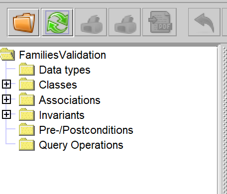
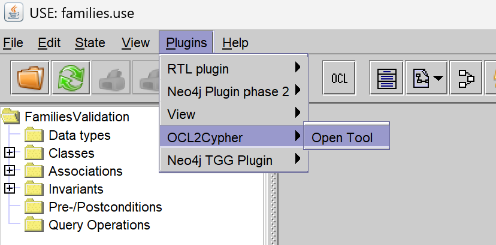
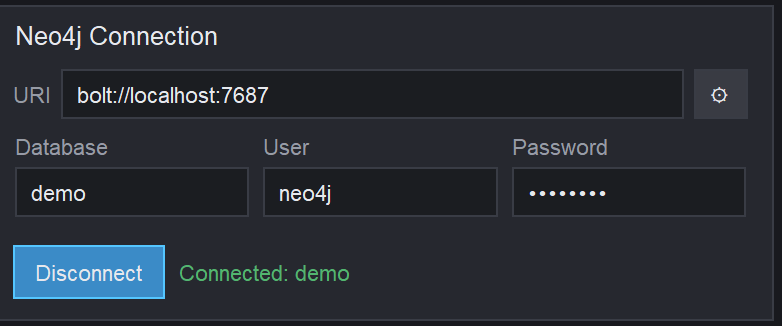
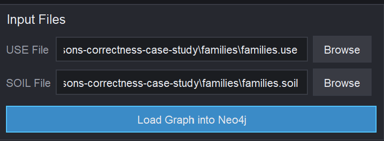
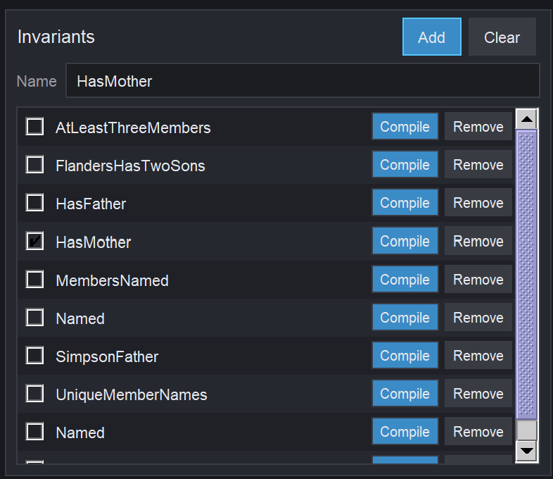
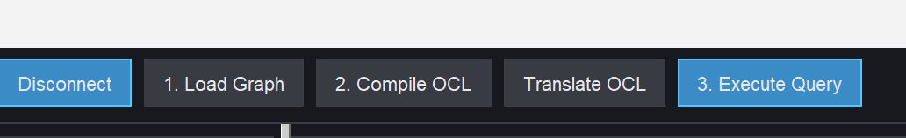
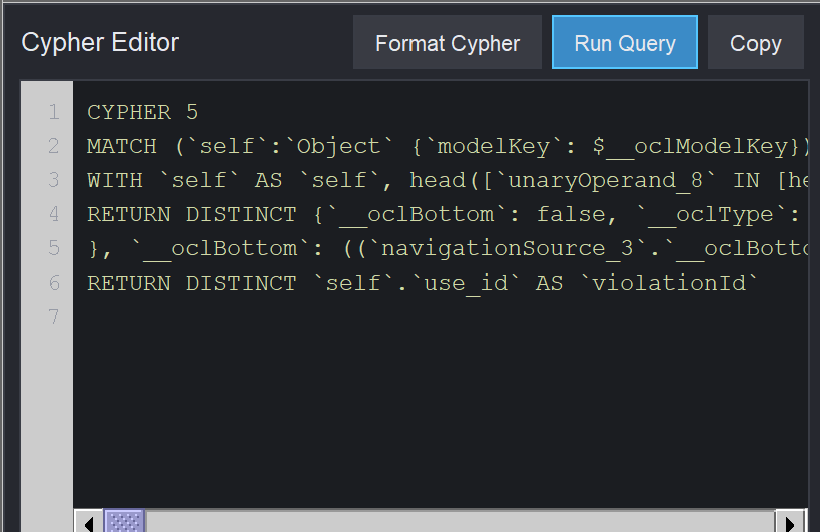
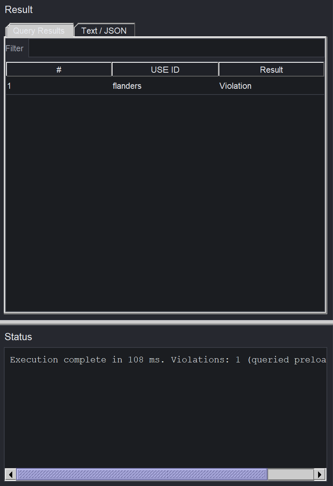

# OCL2Cypher Framework

OCL2Cypher is a USE plugin for loading UML/OCL models and object snapshots from
USE/SOIL into Neo4j, translating OCL invariants to **Cypher 5**, executing the
generated queries, and comparing Neo4j violation IDs with the result evaluated
by USE.

```text
USE (.use) + SOIL (.soil)
        |
        +-- build and load the property graph into Neo4j
        |
OCL invariant -- Compile -- Translate -- Cypher 5
                                           |
                                           +-- violation IDs from Neo4j
                                           +-- comparison with USE
```

> `ocl2cypher` is the Neo4j integration shipped with this USE distribution.
> The legacy `neo4j` and `neo4j-tgg` plugins have been removed from the build
> and are not runtime dependencies of OCL2Cypher.

## Contents

- [Requirements](#requirements)
- [Build and launch](#build-and-launch)
- [Usage workflow](#usage-workflow)
- [Graph View](#graph-view)
- [How graph data is stored in Neo4j](#how-graph-data-is-stored-in-neo4j)
- [Using generated Cypher in Neo4j Desktop or Browser](#using-generated-cypher-in-neo4j-desktop-or-browser)
- [Troubleshooting](#troubleshooting)
- [Testing and research documentation](#testing-and-research-documentation)
- [Repository structure](#repository-structure)

## Requirements

- JDK 21 or newer.
- Maven 3.x compatible with the root [`pom.xml`](pom.xml).
- A running Neo4j DBMS with Bolt enabled.
- An existing Neo4j database, such as `neo4j` or `demo`.
- A `.use` model and a matching `.soil` object snapshot.

OCL2Cypher does not start the DBMS or create a database. Start Neo4j first and
prepare the connection information:

```text
URI       bolt://localhost:7687
Database  neo4j
User      neo4j
Password  <your Neo4j password>
```

## Build and launch

### Build the complete distribution

Run from the repository root:

```powershell
mvn clean package
```

The distribution archives are written to:

```text
use-assembly/target/use-7.1.0.zip
use-assembly/target/use-7.1.0.tar.gz
```

Extract an archive and launch USE:

```powershell
# Windows
.\use-7.1.0\bin\use.bat
```

```bash
# Linux or macOS
./use-7.1.0/bin/use
```

The distribution must contain the plugin at:

```text
use-7.1.0/lib/plugins/ocl2cypher-7.1.0.jar
```

### Build and test only the plugin

```powershell
mvn -pl ocl2cypher -am clean install
```

The plugin JAR is created at
`ocl2cypher/target/ocl2cypher-7.1.0.jar`. If you copy the JAR manually into
`lib/plugins`, keep only one `ocl2cypher-*.jar` version and restart USE
completely.

## Usage workflow

The steps below use the Families case study:

- [`families.use`](example/families-to-persons-correctness-case-study/families/families.use)
  defines the schema, associations, and invariants.
- [`families.soil`](example/families-to-persons-correctness-case-study/families/families.soil)
  defines the object snapshot.
- [`expected-violations.csv`](example/families-to-persons-correctness-case-study/families/expected-violations.csv)
  contains the reference violation set.

### 1. Start USE

You may open `families.use` in the main USE window to inspect its classes,
associations, and invariants. This is optional; the OCL2Cypher workbench still
requires explicit paths to the `.use` and `.soil` files.



### 2. Open OCL2Cypher

Select **Plugins > OCL2Cypher > Open Tool**.



### 3. Connect to Neo4j

Enter the `URI`, `Database`, `User`, and `Password`, then select **Connect**. A
successful connection displays `Connected: <database>`.



`Database` is the name of an existing Neo4j database. It is not the
`modelKey`. The `modelKey` comes from the `model` declaration in the USE file;
for example, `FamiliesValidation`.

### 4. Select USE/SOIL files and load the graph

In **Input Files**:

1. Select a `.use` file under **USE File**.
2. Select its `.soil` file under **SOIL File**.
3. Select **Load Graph into Neo4j** or **1. Load Graph**.



The plugin parses both files, validates the snapshot, builds the canonical
graph representation, and writes it to Neo4j. The invariant list and compile
controls are enabled only after this step succeeds.

### 5. Select an invariant

Select exactly one invariant. Use **Compile** on its row, or check it and then
select **2. Compile OCL**.



The **Name** field shows the current invariant. **Remove** only removes an entry
from the displayed list; it does not modify the `.use` file.

### 6. Compile and translate to Cypher 5

The workflow has two operations:

1. **2. Compile OCL** parses and type-checks the invariant, then lowers it to
   the typed intermediate representation.
2. **Translate OCL** generates Cypher 5 and places it in the **Cypher Editor**.



The internal query may contain generated parameters. When the query runs in
the plugin, the Neo4j Java Driver supplies all required parameter values.

### 7. Execute the query

Review the generated query, then select **3. Execute Query** or **Run Query**.



This step submits the query to the graph loaded earlier. The plugin does **not**
delete and rebuild the graph every time an invariant is executed. After Neo4j
returns its result, the plugin evaluates the invariant with USE and compares
the two `violationId` sets.

### 8. Read the result

**Query Results** lists the USE IDs of violating objects. **Text / JSON** shows
the violation set, comparison result, execution time, and generated Cypher.



| Status | Meaning |
|---|---|
| `PASS` | USE and Neo4j return the same violation-ID set. |
| `MISMATCH` | The sets differ; the report identifies the differing IDs. |
| `UNAVAILABLE` | Cypher ran, but the USE evaluation step could not be completed. |

An empty result means that no object in the snapshot violates the invariant;
it does not indicate a query error.

## Graph View

Graph View is a projection of the graph stored in Neo4j, not a separate graph.

- The initial view displays only **SCHEMA** nodes.
- Select a node to reveal its direct neighbours and incident edges.
- Continue selecting newly revealed nodes to expand the view incrementally.
- Select **Schema** to return to the schema-only view.
- Drag a node to reposition it, drag empty space to pan, and use the mouse wheel
  or `+`/`-` to zoom.
- Use **Fit** to fit the visible graph into the viewport.
- The legend identifies each projection and shows visible and total node counts.

Hiding a node in Graph View does not delete data or change query scope.

## How graph data is stored in Neo4j

Each model is isolated by its `modelKey`. When **Load Graph** runs:

1. The plugin computes a fingerprint of the canonical graph.
2. If a graph with the same encoding, fingerprint, and cardinalities already
   exists, the plugin reuses it.
3. If the snapshot changed, only the OCL2Cypher-managed graph in that namespace
   is replaced.
4. The schema is written first, followed by the object snapshot in the same
   transaction.
5. Cardinalities are checked before commit; a failure in either phase rolls the
   transaction back.

The plugin does not delete the complete database or modify other namespaces.
If a namespace with the same name contains data not owned by OCL2Cypher, the
plugin reports `MODEL_NAMESPACE_NOT_OWNED` instead of overwriting it.

## Using generated Cypher in Neo4j Desktop or Browser

Do not manually select and copy the raw editor text when it contains generated
parameters such as:

```text
$__oclModelKey
$__oclContextClassKey
$__oclRole_2
```

Pasting the raw parameterized query into Neo4j Browser without defining its
parameters causes `42N81: missing request parameter`.

Use the plugin's **Copy** button instead. It produces a self-contained query by
inlining generated parameter values, so the query can be pasted directly into
Neo4j Desktop or Browser. **Export** writes the same standalone form to a
`.cypher` file.

## Troubleshooting

### OCL2Cypher is missing from the menu, or the old UI is still displayed

- Verify that `lib/plugins/ocl2cypher-7.1.0.jar` exists in the USE distribution
  you actually launched.
- Do not keep multiple `ocl2cypher-*.jar` files in `lib/plugins`.
- Close every USE/Java process before launching the newly built distribution.
- The latest packaged distribution is under `use-assembly/target`.

### Neo4j connection fails

- Confirm that the DBMS is running and Bolt is enabled.
- Check the URI, database, user, and password.
- Neo4j Community Edition normally uses the default `neo4j` database.
- Run `RETURN 1` in Neo4j Browser to verify the connection independently.

### Workflow controls are disabled

The controls follow this order:

```text
Connect -> Load Graph -> select invariant -> Compile -> Translate -> Execute
```

After disconnecting or changing the connection, reload the graph so the plugin
can verify it against the active connection.

### Neo4j reports a missing request parameter

Use the plugin's **Copy** action instead of copying raw text from the Cypher
Editor.

### The first run is slow

**Load Graph** must parse and materialize the model and snapshot. The first
execution may also invoke USE to obtain the comparison result, which is reused
within the session. Subsequent **Execute Query** operations do not rebuild the
graph automatically.

## Testing and research documentation

Run the Java regression suite:

```powershell
mvn -pl ocl2cypher test
```

Run live Neo4j tests against a dedicated test database:

```powershell
$env:OCL2CYPHER_RUN_NEO4J_E2E = 'true'
$env:NEO4J_URI = 'bolt://localhost:7687'
$env:NEO4J_DB = 'neo4j'
$env:NEO4J_USER = 'neo4j'
$env:NEO4J_PASSWORD = '<password>'
mvn -pl ocl2cypher test
```

Build the Lean proofs and check verification mappings:

```powershell
Set-Location verification/lean
lake build Ocl2Gratra
Set-Location ../..
./verification/scripts/check-verification-contract.ps1
./verification/scripts/check-implementation-conformance.ps1
```

Normative and research documentation:

- [Representation and compilation specification](specification/README.md)
- [Proof and evidence status](verification/README.md)
- [Experimental protocol](experiments/README.md)
- [Full technical report](research/SOICT_conf/fulltechreport)
- [Main paper](research/SOICT_conf/Paper_formal_EN)

The correctness chain is:

```text
source OCL
   -- Front_S --> typed Core
   -- T_Sigma --> typed Q
   -- Violations/Realize_Sigma --> Cypher and result contract
   -- execution/decoding --> violation-ID set
```

## Repository structure

| Component | Location | Purpose |
|---|---|---|
| Production plugin | [`ocl2cypher/src/main`](ocl2cypher/src/main) | Frontend, Core/Q IR, graph builder, Cypher generation, and execution |
| Tests | [`ocl2cypher/src/test`](ocl2cypher/src/test) | Conformance, differential, rejection, UI, and Neo4j tests |
| Specification | [`specification`](specification) | Representation, OCL core, Q target, and proof obligations |
| Formal proofs | [`verification/lean`](verification/lean) | Lean definitions and preservation results |
| Evidence | [`verification`](verification) | Contracts, coverage, evidence, and runtime obligations |
| Experiments | [`experiments`](experiments) | Research questions, corpus, commands, and results |
| OCL2Cypher examples | [`example`](example) | Models, snapshots, constraints, and expected results |
| Manuscripts | [`research/SOICT_conf`](research/SOICT_conf) | Main paper and full technical report |

For reproducible experimental reports, record the commit, tool versions, Neo4j
configuration, command line, and output directory. Do not overwrite reviewed
expected-result files.
